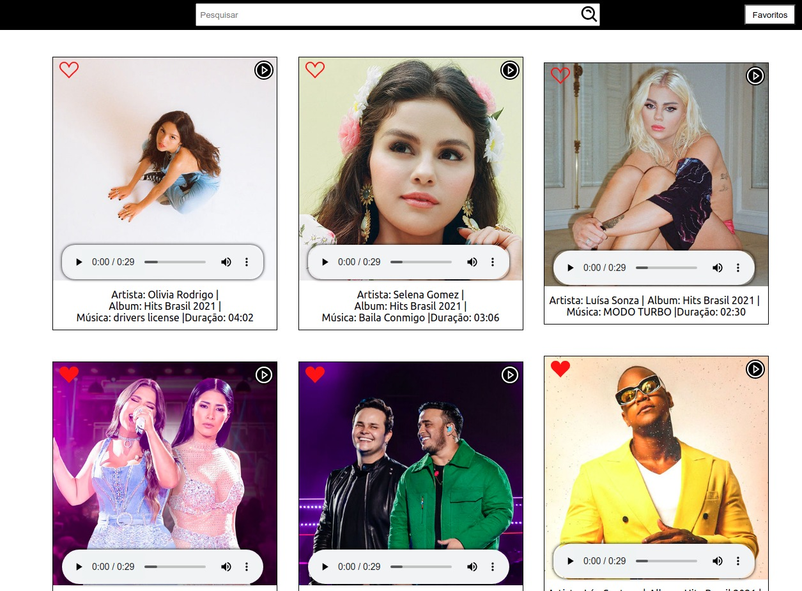

<div align="center">
    
</div>

</br></br>

<h2>Sobre o Projeto </h2>
</br>
<div>
<p>Projeto construído com ReactJS, é um projeto para avaliação de capacidades, visa construir um webapp que consulta a api da Deezer e apresenta as musicas mais tocadas no momento, com campo de pesquisa para encontrar músicas e álbuns de determinado cantor e/ou playlist, contém também a opção de adicionar e remover músicas como favoritas e consultar essa lista e ouvir trechos das músicas.
</p>
</div>
<h2>Tecnologias utilizadas:</h2>
<div >
<ul>
<li>ReactJS</li>
<li>Redux</li>
<li>Styled Components</li>
<li>Axios</li>
<li>React Icons</li>
</ul>
</div>
</br>
<h2>Como executar o projeto</h2>

```bash

# clonar repositório

git clone git@github.com:Paulo-cds/teste-prototipo-deezer.git

# entrar na pasta do projeto

cd projeto

# instalar dependencias

Rodar comando yarn

# executar o projeto

yarn start

o projeto será executado no localhost:3000

```

</br>
<h2>Autor:</h2>
<p>Paulo Ricardo Pereira Domingues</p>
<p><a href="https://www.linkedin.com/in/paulorpd/" target="blanck">https://www.linkedin.com/in/paulorpd/</a></p>
<p><a href="https://paulo-rpd.vercel.app/" target="blanck">https://paulo-rpd.vercel.app/</a></p>
